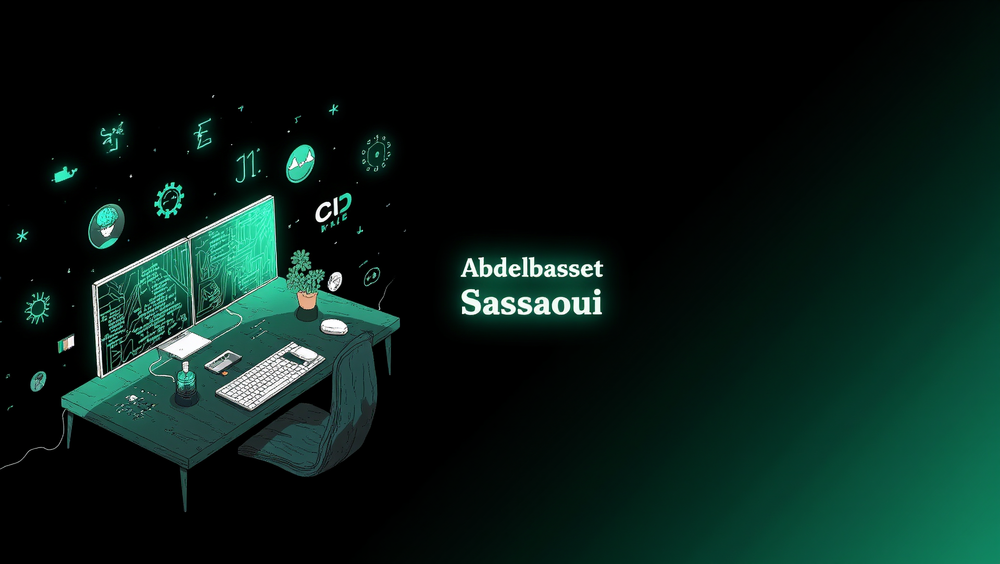

<!-- Banner / Header Image -->

<h1 align="center">Hi 👋, I'm Abdelbasset Sassaoui</h1>

---
## 🚀 About Me

👋 Hi! I'm **Abdelbasset Sassaoui**, a passionate **Data Scientist** with a solid background in **Full-Stack Development**, **DevOps**, and **Microservices Architecture**.  

🎓 Former **Mathematics Teacher**, I bring a strong analytical mindset and a passion for solving real-world problems using data and technology.

💡 I’m highly interested in:
- 🧠 **Machine Learning** & **Deep Learning**
- 🏗️ **Microservices** & **API Design**
- ⚙️ **DevOps** (CI/CD, Docker, Kubernetes ...)
- 🔐 **System Design** & **Software Architecture**

🧠 I'm deeply curious and always eager to learn new technologies. I enjoy building projects that solve real-world problems and improve user experiences.

## 🛠️ Tech Stack

### 💻 Languages

### 🌐 Frontend & Backend

### 🧠 AI & Data Tools

### ⚙️ DevOps & Cloud

---

## 🔥 GitHub Streak Stats

  

---

## 🔗 Featured Projects

###Smart Bookshelf

Development of a personalized book recommendation platform using AI and IoT.  
By capturing a user's facial image, a facial recognition model with 90% accuracy analyzes features such as age, gender, and emotion to recommend books, both from the physical library and digital platforms.  
Physical books are equipped with chips that automatically read their summaries.  
Recommendations are continuously improved based on the user's reading history.

---

### DevOps Infrastructure Deployment

Automated DevOps infrastructure deployment on Azure using Kubernetes for container orchestration.  
Utilized GitLab CI and Jenkins for CI/CD pipelines, Terraform for provisioning virtual machines, and Ansible for configuration management, ensuring fast and secure deployments.

---

### 🏘️ Student Residence Manager

Development of a student residence management application using React.js and Spring Boot.  
Features include managing rooms, residents, and payments, with integration of the PayPal API for transaction processing.  
JWT is used to secure user access and management. An interactive dashboard displays key statistics.

---

### 🧠 ResearchUnity Social Networking Platform for Scientific Collaboration

Development of ResearchUnity, a platform that enables researchers to publish, share, and discover academic work. Key features include research profile management, document publishing, and a customized chat interface to facilitate real-time communication and collaboration among researchers.

### 🧪 DevOps Lab  
An automated microservice deployment system using Docker, GitHub Actions, Terraform & AWS. Implements monitoring and alerting with Prometheus and Grafana.

---

## 📫 Contact

- 💼 [LinkedIn](https://www.linkedin.com/in/abdelbasset-sassaoui/)
- 📧 Email: `abdelbassetsassaoui55@gmail.com`

---

*Let’s build something awesome together!*
